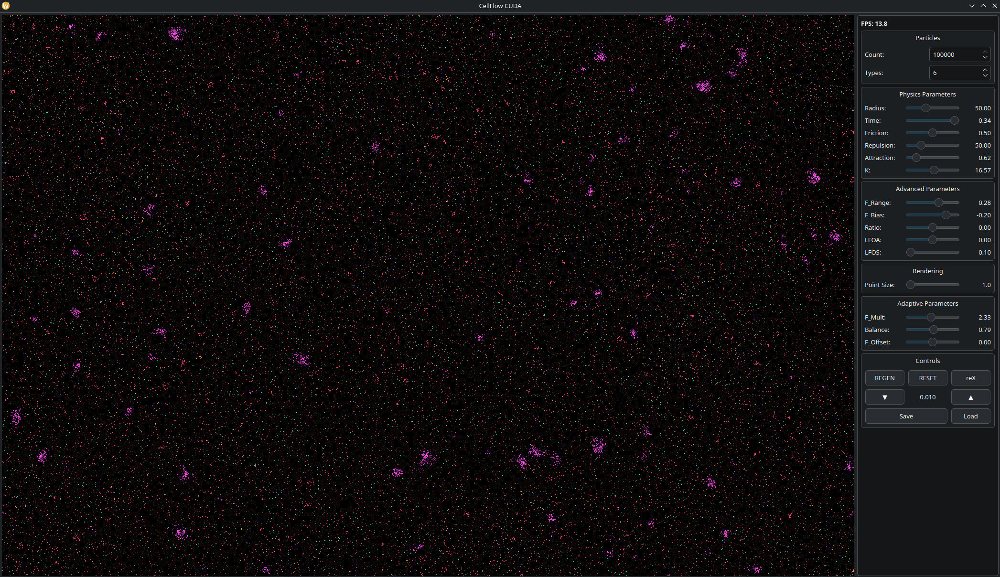
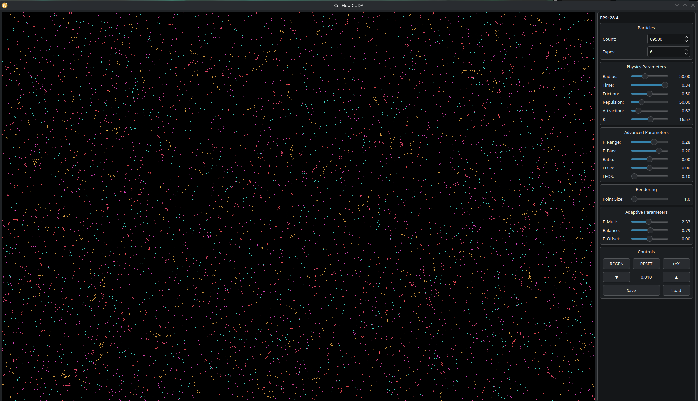

# CellFlow

**💪 CUDA Native: 100,000 particles @ 13 FPS**

CellFlow is a novel particle simulation algorithm that exhibits emergent behaviors resembling life - from single-cell organisms to ecosystems like coral reefs, and occasionally even planetary or galactic formations. The system builds upon foundational concepts from Clusters by Jeffrey Ventrella and Particle Life by Tom Mohr, introducing significant algorithmic improvements for more organic and complex behaviors.

## Key Features

### Smooth Force Function
The original particle life algorithms use abrupt transitions between attraction and repulsion zones, causing unnatural particle jumps. CellFlow implements a continuous force function with three parameters (attraction, repulsion, and k factor) that creates fluid, lifelike motion without sudden discontinuities.

### GPU-Accelerated Performance
The WebGPU implementation enables simulation of 4,000-8,000 particles on laptop GPUs, with potential for 50,000-100,000 particles on high-end hardware - a significant improvement over the ~700 particles achievable in vanilla JavaScript.

### Advanced Interaction Systems
- **Force Matrix**: Defines attraction/repulsion relationships between particle types using Gaussian distributions with customizable bias and offset
- **Variable Interaction Radius**: The "ratio" parameter morphs behavior from fluid, liquid-like forms to solid, ossified patterns
- **Neighborhood-Based Physics**: Particles respond to local density with dynamic acceleration or friction
- **Extended Balance Range**: Values beyond 1.0 create exotic behaviors including time-reversal effects and black hole-like structures

## Live Demo

Experience CellFlow directly in your browser: https://spherical-sound-society.github.io/CellFlow/

### Controls
- **Number Keys 1-8**: Load preset configurations
- **Spacebar**: Generate new force matrix
- **X**: Toggle UI visibility
- **C**: Toggle slider clutter

## Technical Documentation

For detailed algorithm explanations and implementation details, see: https://www.youtube.com/watch?v=E8vvSu8PZmI

## Open Source

CellFlow is released as open source to encourage learning, experimentation, and community contributions. The codebase includes implementations in multiple languages and comprehensive parameter controls for exploring emergent behaviors.

## Performance Screenshots

### 🚀 Optimal Performance: 69,500 particles @ 30 FPS
> **CUDA Native** | RTX 4060 Ti | Qt6/Wayland | Real-time interaction

## CUDA Native Implementation

A high-performance CUDA implementation is available in the `cuda-native/` directory, offering:
- **12-17x performance improvement** over WebGPU
- Support for **100,000+ particles** in real-time
- Native Qt6 interface for Linux/Wayland
- See [cuda-native/README.md](cuda-native/README.md) for details

### Performance Demo

